# Eendragt

## Sollicitaties

Eendragt laat gebruikers solliciteren op bepaalde posities. Momenteel zijn dat er vier:

* **NL-Diplomaat** - Een lid dat contact onderhoudt met andere communities.
* **Community Support** - Een lid dat modereert in de community.
* **Pixel Artists** - Een lid dat artwork maakt voor de suggesties.
* **Redacteur** - Een lid dat informatie verzamelt en maakt voor het PlaceNL Journaal.

Wanneer je op een van de knoppen klikt krijg je een modal te zien waar je je sollicitatie kan indienen.

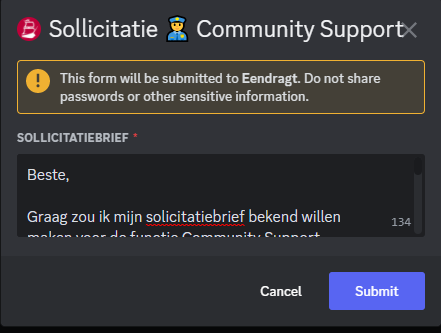

Wanneer je je sollicitatie hebt ingediend stuurt de bot jouw sollicitatie naar een sollicitaitiekanaal. Hier kunnen de leidinggevenden van de categorie waarop je hebt gesolliciteerd je sollicitatie beoordelen. Hierbij komen de rollen te staan die je vorig jaar had. Zo weten we bijvoorbeeld of je eerder ook al NL-diplomaat was.

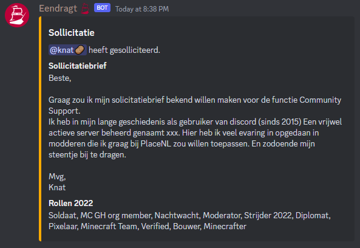

Met het commando `/rol` kan een moderator de rol NL-diplomaat en Pixel Artist geven aan een ander lid. Met hetzelfde commando kan de rol ook weer worden afgepakt.

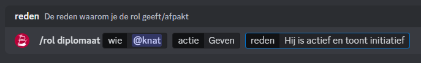

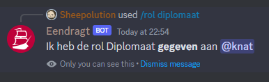

## Threads

Met de Manage Threads permissie zou een lid alle threads kunnen verwijderen. Om dit te voorkomen heeft Eendragt functionaliteiten om threads wel te kunnen beheren, zonder deze te kunnen verwijderen.

### Tags

Met het commando `/tags` kan een moderator (en Community Support) de tags van een thread aanpassen.

Nadat je het commando hebt gebruikt krijg je een dropdown menu te zien. Hier kan je één of meerdere tags selecteren. Deze tags worden dan aan de thread toegevoegd.

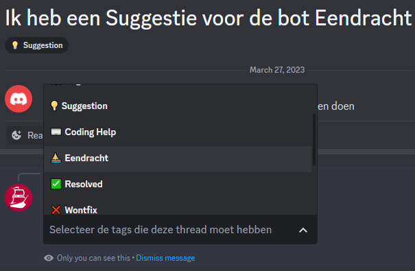

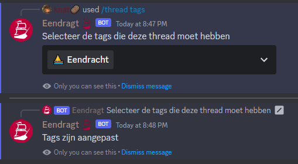

### Archiveren en sluiten

Met het commando `/close` kan een thread geachiveerd worden. Hier kan een reden mee worden gegeven, die dan te zien is in de logs.

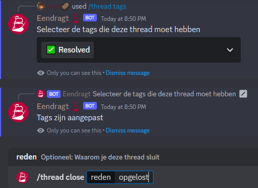

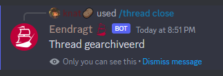

Op diezelfde manier kan met het commando `/lock` kan een thread op slot worden gezet.

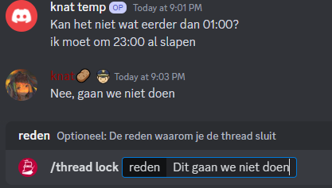

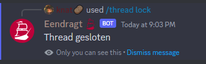

## Suggesties

Het suggesties-kanaal is het hart van onze democratie. Om alles zo eerlijk mogelijk te laten verlopen automatiseert Eendragt het proces voor een suggestie om genomineerd te worden voor het canvas.

Wanneer iemand een nieuwe post maakt met een suggestie, dan stuurt de bot automatisch een bericht. Er wordt ook bijgehouden en gekeken of eerder al een vergelijkbare suggestie is gedaan. Zo ja, dan wordt dit toegevoegd aan het bericht. De maker van de thread, of een moderator, kan dan kiezen of ze de thread willen sluiten.

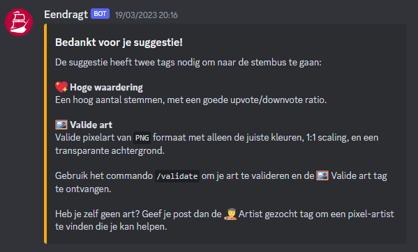

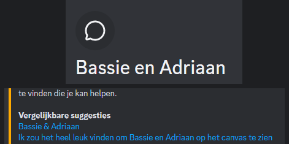

Bij het aanmaken van de suggestie geeft de bot deze automatisch een upvote en downvote reaction. Leden kunnen deze emoji gebruiken om op de suggestie te stemmen. Bij een hoog aantal upvotes (en in verhouding weinig aantal downvotes) zal de suggestie een 💖 Hoge waardering-tag krijgen.

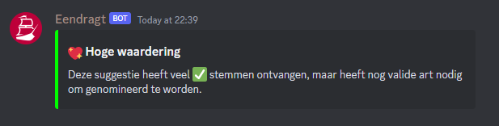

### Art

Wanneer er een suggestie wordt gedaan met de 🎨 Nieuwe Art-tag of de ✨ Upgrade Art-tag, dan moet de suggestie valide art hebben om genomineerd te kunnen worden. Art kan gevalideerd worden met het `/validate` commando.

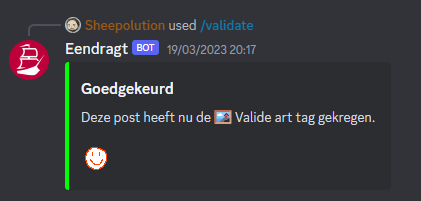

Valide art voldoet aan de volgende criteria:

* Het is een PNG bestand.
* Het heeft een transparante achtergrond.
* Het gebruikt alleen de kleuren die r/place gebruikt.
* Het is 1x1 scaling.

Alleen die laatste kan de bot niet controlleren, maar de eerste drie worden dus wel gecontrolleerd door de bot. Wanneer een van de drie niet klopt, dan zal de bot aangeven wat er precies mis is.

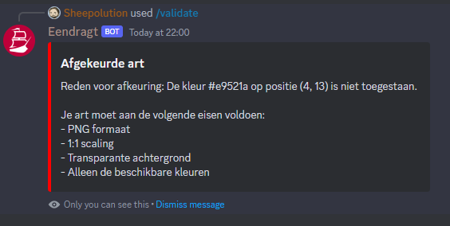

Wanneer een suggestie de benodigde tags heeft, zal deze genomineerd worden. Er wordt een bericht gestuurd in het #nominatie kanaal, en de suggestie krijgt een ⭐ Nominatie-tag.

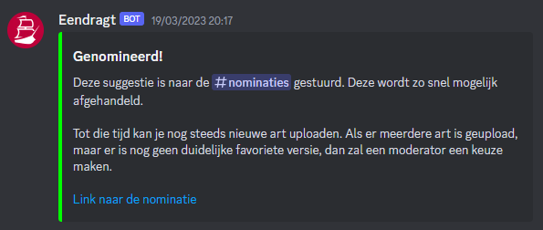

### Nominaties

Wanneer een suggestie genomineerd wordt, dan wordt er een bericht gestuurd in het #nominatie kanaal. 

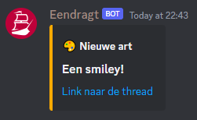

Via menu-commando's kan een canvas coordinator bepalen wat er met de nominatie moet gebeuren. Hiervoor zijn vier opties:
* Goedkeuren - Het is duidelijk dat mensen dit willen, en het heeft geen verdere stemming nodig.
* Stembus - Het gaat mee naar de officiële stemmingen om te bepalen of het op het canvas komt.
* Uitstellen - Het is een goede suggestie, maar er is momenteel geen plek voor op het canvas.
* Afkeuren - De suggestie overtreedt de regels.

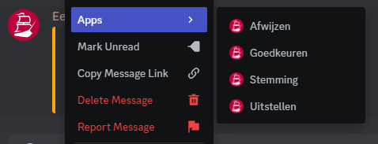

Na het menu-commando te hebben uitgevoerd komt er een modal. Hier wordt gevraagd de actie te bevestigen door het te typen. Dit voorkomt dat er per ongeluk een verkeerde actie wordt uitgevoerd. Verder kan er een reden worden gegeven voor de actie.

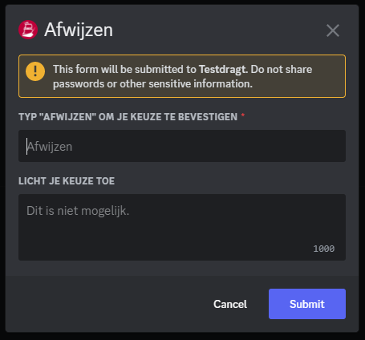

Na het uitvoeren van het commando wordt het originele bericht geupdate met de nieuwe status.

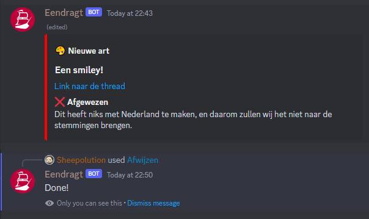

## Art Coordination

Met het `/coordinate` commando kan het plaatsen van kunswerken op het canvas worden gecoördineerd, zonder dat daarvoor een autoplacer nodig is. Bij het uitvoeren van het commando moet je een afbeelding meegeven, een x en y positie, en optioneel een tijd wanneer men de pixels moeten plaatsen.

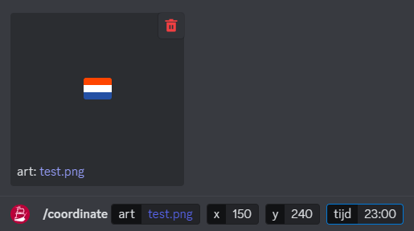

Na het commando te hebben gebruikt verschijnt er een bericht met daarin de ingevulde informatie. Leden kunnen op de knop klikken om een pixel te claimen.

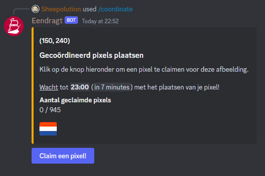

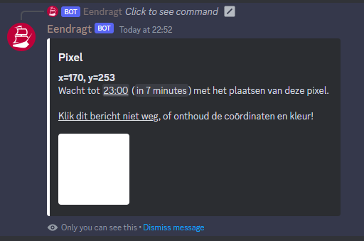

Het lid wordt vertelt waar en wanneer ze een pixel moeten plaatsen, en van welke kleur. Wanneer alle leden dit tegelijkertijd doen zou er in no-time het kunstwerk op het canvas moeten staan.

## Grid

Met het `/grid` commando kan er een grid worden gegeneerd met de meegegeven pixel art. In dit grid staan de x- en y-coördinaten van elke pixel, aan de hand van de meegegeven positie. Deze afbeelding kan gebruikt worden als handleiding bij het handmatig plaatsen van pixels.

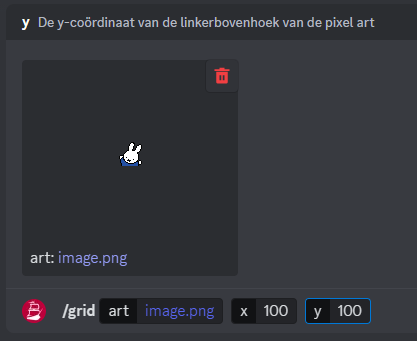

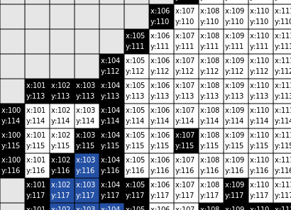

## Template

Met het `/template` commando kan er een afbeelding worden gegeneerd ter grote van het canvas, met de meegegeven pixel art op de meegegeven positie. Dit is handig voor Canvas Coordinators wanneer zij de art in de template moeten plaatsen.

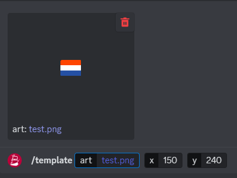

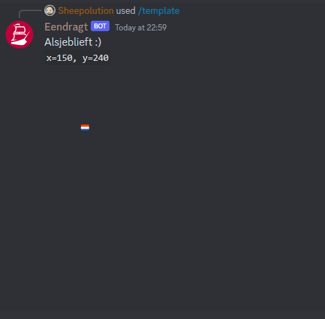

## Stemmingen

Met Eendragt kan je een stemming uitvoeren. Je start een stemming met het `/stemming` commando. Hierbij geef je een afbeelding, en optioneel hoelang de stemming moet duren.

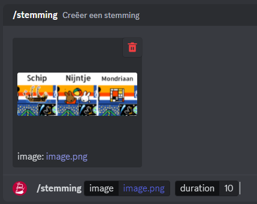

Wanneer je dit doet krijg je een modal te zien. In het eerste vak vul je een beschrijving in. Dit is optioneel, en indien leeggelaten zal het een standaard tekst hebben.

Het tweede vak is ook optioneel, en dient alleen ingevuld te worden wanneer het geen ja/nee stemming is. Hierin vul je de opties in die de leden kunnen kiezen. Elke optie moet op een nieuwe regel staan. Door twee keer een dubbele punt te plaatsen (`::`) kan je een beschrijving toevoegen. In deze beschrijving kan je embedded links gebruiken ( \[text\]\(url\) ).

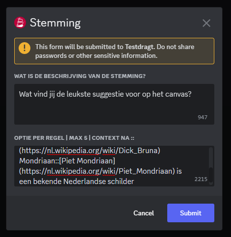

Wanneer je de modal hebt ingevuld krijg je een preview te zien. Als deze er goed uitziet klik je onderaan op "Ja, stuur het".

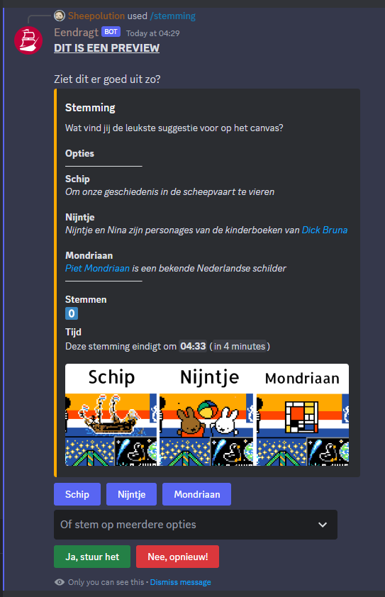

Wanneer je meerdere opties hebt komt er onder de knoppen een dropdown te staan. Hierin kan je stemmen op meerdere opties tegelijkertijd.

Als de tijd voorbij is worden de resultaten getoond, en daarmee ook de winnaar.

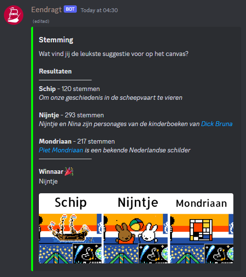

## Diplomatie

### Onboarding

Eendragt automatiseert de onboarding van diplomaten. Wanneer een lid klikt op **I'm here for diplomacy** dan krijgen ze onderstaande modal te zien. Hier vult de diplomaat informatie over hun community in, en wat ze willen bespreken.

Nadat ze deze hebben ingevuld krijgt het lid de Diplomat rol, en wordt er een privé thread aangemaakt in #diplomacy-threads met alleen het lid. Daar krijgen ze een welkomsbericht te zien, met onderaan de mogelijkheid om maximaal twee leden, hun mede-diplomaten, toe te voegen.

In het #dispatch kanaal komt een bericht te staan met de ingevulde informatie, en een knop. De NL-diplomaat die er op klikt wordt in de privé thread gezet met de diplomaat van de community.

Het kan zijn dat meerdere diplomaten van dezelfde community een thread starten. Wanneer er al een thread bestaat met een vergelijkbare naam, dan zal dit worden aangegeven. De DiploMods kunnen daar dan actie op ondernemen.

Wanneer een NL-diplomaat zich onprofessioneel gedraagd, of wanneer deze afwezig is, dan kan de diplomaat van de community op de Help knop klikken. Er opent dan een modal waar de diplomaat meer context kan geven over wat er aan de hand is.

De melding wordt in het #reports kanaal gestuurd, waar DiploMods kunnen bepalen hoe ze actie ondernemen.

### Voice

Wanneer de diplomaat en jij willen praten in een voicekanaal, dan kan je daarvoor het `/voice` commando gebruiken.

Hiermee wordt een tijdelijk voicekanaal aangemaakt. Zodra iemand in het voicekanaal gaat wordt er gewacht tot het kanaal weer leeg is. Zodra dat gebeurt wordt het kanaal verwijderd.

### Treaties

Wanneer je iets hebt afgesproken met een diplomaat van een andere community, dan moet het nog wel goedgekeurd worden. Vraag aan een DiploMod om een verdrag op te stellen.

De DiploMod kan het `/treaty` commando gebruiken om een verdrag te genereren. Hierbij zijn er drie keuzes:

**Non-Agression**

Wij spreken met de andere partij af dat we elkaar niet aanvallen. Het betekent niet dat we elkaar helpen te verdedigen, alleen dat wij elkaars grenzen respecteren.

**Mutual Defense**

Wij spreken met de andere partij af dat als een van ons wordt aangevallen, de andere partij ons zal helpen verdedigen.

**Solidarity**

Wij helpen de andere partij artwork te bouwen, en in ruil daarvoor gebruikt de community van de andere partij onze autoplacers. Het zijn ten slotte onze autoplacers die hun artwork bouwen.

**Friendship**

We sluiten vriendschap met de andere partij. Op de grens van onze gebieden plaatsen we artwork die relevant is voor ons beiden (bijvoorbeeld Alfred met Japan).

**Acquisition**

Wij verhuizen de partij naar een andere plek, zodat wij de plek kunnen claimen waar de partij momenteel op staat.

**Custom**

Als je geen van bovenstaande opties kan gebruiken, dan kan je een eigen verdrag opstellen.

Na het uitvoeren van het commando krijg je een bericht met een afbeelding. De bedoeling is dat je deze ondertekent en vervolgens naar de diplomaat van de community stuurt, zodat ook die het kan ondertekenen.

Wanneer beide partijen het hebben ondertekend is het verdrag compleet.

