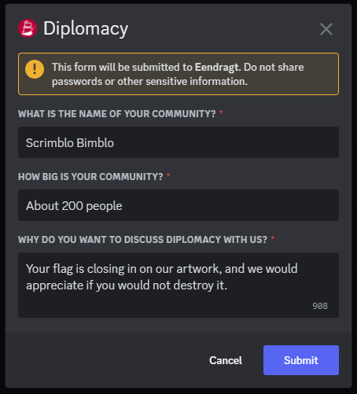
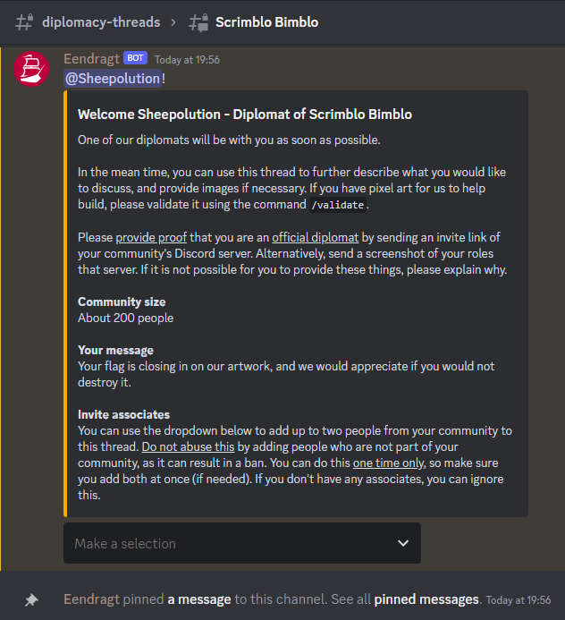
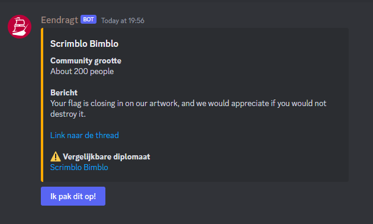
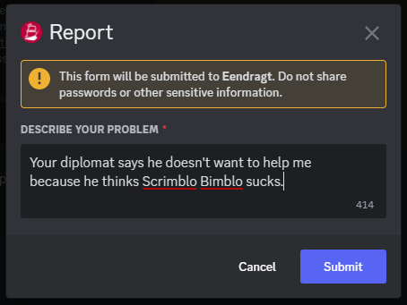
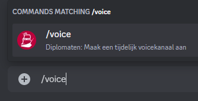
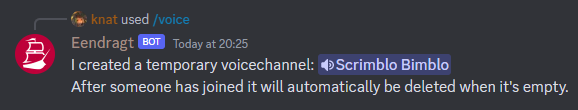
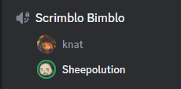
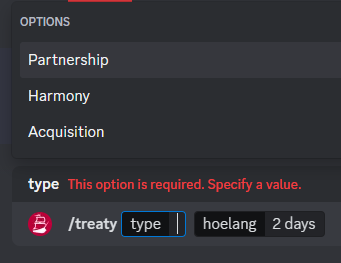
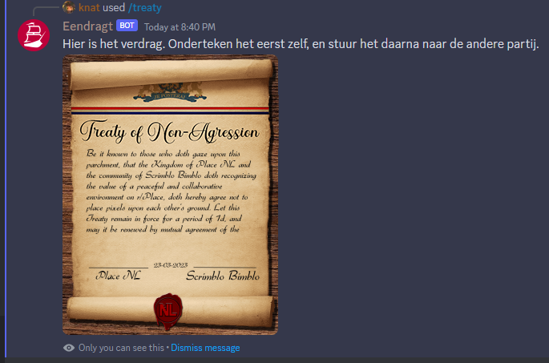
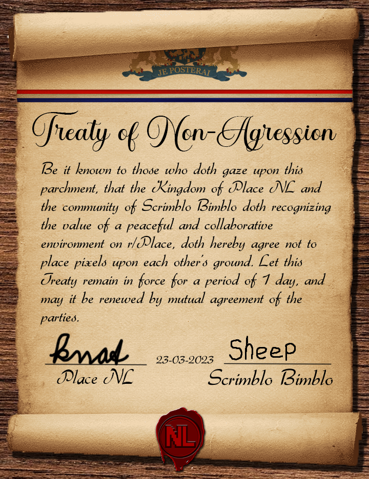

# Eendragt

## Diplomatie

### Onboarding

Eendragt automatiseerd de onboarding van diplomaten. Wanneer een lid klikt op **I'm here for diplomacy** dan krijgen ze onderstaande modal te zien. Hier vult de diplomaat informatie over hun community in, en wat ze willen bespreken.

Nadat ze deze hebben ingevuld krijgt het lid de Diplomat rol, en wordt er een privé thread aangemaakt in #diplomacy-threads met alleen het lid. Daar krijgen ze een welkomsbericht te zien, met onderaan de mogelijkheid om maximaal twee leden, hun mede-diplomaten, toe te voegen.

In het #dispatch kanaal komt een bericht te staan met de ingevulde informatie, en een knop. De NL-diplomaat die er op klikt wordt in de privé thread gezet met de diplomaat van de community.

Het kan zijn dat meerdere diplomaten van dezelfde community een thread starten. Wanneer er al een thread bestaat met een vergelijkbare naam, dan zal dit worden aangegeven. De DiploMods kunnen daar dan actie op ondernemen.

Wanneer een NL-diplomaat zich onprofessioneel gedraagd, of wanneer deze afwezig is, dan kan de diplomaat van de community op de Help knop klikken. Er opent dan een modal waar de diplomaat meer context kan geven over wat er aan de hand is.

De melding wordt in het #reports kanaal gestuurd, waar DiploMods kunnen bepalen hoe ze actie ondernemen.

### Voice

Wanneer de diplomaat en jij willen praten in een voicekanaal, dan kan je daarvoor het `/voice` commando gebruiken.

Hiermee wordt een tijdelijk voicekanaal aangemaakt. Zodra iemand in het voicekanaal gaat wordt er gewacht tot het kanaal weer leeg is. Zodra dat gebeurt wordt het kanaal verwijderd.

### Treaties

Wanneer je iets hebt afgesproken met een diplomaat van een andere community, dan moet het nog wel goedgekeurd worden. Vraag aan een DiploMod om een verdrag op te stellen.

De DiploMod kan het `/treaty` commando gebruiken om een verdrag te genereren. Hierbij zijn er drie keuzes:

**Partnership**

Wij helpen de andere partij artwork te bouwen, en in ruil daarvoor gebruikt de community van de andere partij onze bots. Het zijn ten slotte onze bots die hun artwork bouwen.

**Harmony**

Wij spreken met de andere partij af dat we elkaar niet aanvallen. Het betekent niet dat we elkaar helpen te verdedigen, alleen dat wij elkaars grenzen respecteren.

**Acquisition**

Wij verhuizen de partij naar een andere plek, zodat wij de plek kunnen claimen waar de partij momenteel op staat.

Na het uitvoeren van het commando krijg je een bericht met een afbeelding. De bedoeling is dat je deze ondertekent en vervolgens naar de diplomaat van de community stuurt, zodat ook die het kan ondertekenen.

Wanneer beide partijen het hebben ondertekend is het verdrag compleet.

